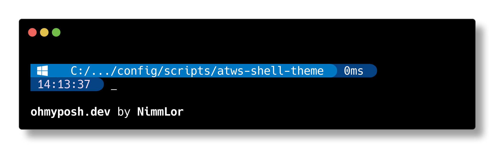

<h1 align="center">✨ atws-shell-theme</h1>

A custom theme for [oh-my-posh](https://ohmyposh.dev) that uses the [Hack](https://sourcefoundry.org/hack/) font and is based on [velvet](https://github.com/JanDeDobbeleer/oh-my-posh/blob/main/themes/velvet.omp.json).



### Usage

1. Install [oh-my-posh](https://ohmyposh.dev/docs/installation)

Powershell

```powershell
Set-ExecutionPolicy Bypass -Scope Process -Force; Invoke-Expression ((New-Object System.Net.WebClient).DownloadString('https://ohmyposh.dev/install.ps1'))
```

Bash

```bash
sudo wget https://github.com/JanDeDobbeleer/oh-my-posh/releases/latest/download/posh-linux-amd64 -O /usr/local/bin/oh-my-posh

sudo chmod +x /usr/local/bin/oh-my-posh
```

2. Install the `Hack NF` font

```powershell
oh-my-posh font install Hack
```

3. Configure your terminal to use the `Hack NF` font. Use the value `Hack NF`.
   See the [docs](https://ohmyposh.dev/docs/installation/fonts#configuration) on how to configure your terminal.

For VSCode, add the following to your `settings.json`:

```json
{
  "terminal.integrated.fontFamily": "Hack NF"
}
```

4. Use the `atws` theme at startup

Powershell, use the theme at startup using `$PROFILE`

```powershell
New-Item -Path $PROFILE -Type File -Force -Value "oh-my-posh init pwsh --config 'https://raw.githubusercontent.com/Austrian-Web-Services/config/main/scripts/atws-shell-theme/atws.omp.json'"

# reload your profile
. $PROFILE
```

Bash, use the theme at startup using `.bashrc`

```bash
echo "$(oh-my-posh init bash --config 'https://raw.githubusercontent.com/Austrian-Web-Services/config/main/scripts/atws-shell-theme/atws.omp.json')" >> ~/.bashrc

# reload your profile
exec bash
```
